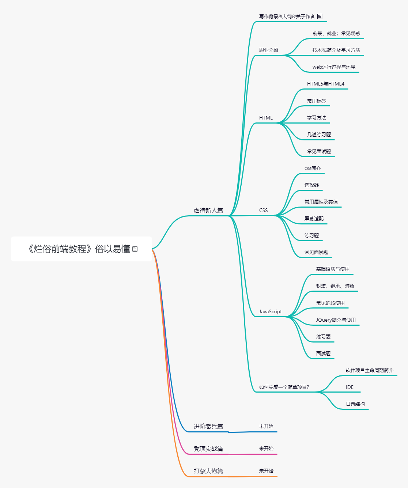

>[《烂俗前端》](https://juejin.cn/column/7017997240325111845)是一部以前端为题材的中长篇中文小说，这个库包含了小说本身的markdown文件和示例源码。

## 讲个故事
  之前在广州一家公司的一个应届生（姓赵，暂且叫他赵铁柱），HR也不知道咋的招过来的，归我来带，技术基础基本为零。铁柱还不错挺聪明，就是有点粗心，有点内向，有些问题不太愿意问，很多心思放在游戏、聊天撩妹这些事情上，虽然有意不让我看到，但我能大概知道他在干嘛，有时候也看到他和群友聊一些龌龊问题，虽然我也聊，但工作时间特别是有事的时候不要摸鱼，是基本的职业素养。

  因为之前一些刚入公司的应届生小朋友，都是基本带着一点基础或者学习能力、学习态度好的，很快就能投入业务工作。
	
  铁柱就不一样了，光有一颗要学习技术的心，但没有正真投入时间精力去学习，也不怎么会学习，看得出来以前并不是经常学习的人。
	
  几个月后还迟迟不能正式投入工作，后面领导想劝退他，我极力给铁柱再争取一次机会，毕竟他还是真心想留下来，并给铁柱下了“最后通牒”，如果两周内再不能达步入业务的水平，就是跟这家公司没有缘分，我也抽更多时间帮助他。
	
  铁柱也有了些危机感，也貌似接受了我之前跟他说的，他现在的学习能力不如别人，就要比别人付出更多努力。但是公司并没有完整的培训体系，校招也是最近两年才招，很多时候，铁柱还是得在网上自己找一些资料，教程零零散散，要么收费比较高，要么就是没有比较难理解，学习相当缓慢。
	
  最后铁柱还是主动离开了，我有点惭愧。还好铁柱把原因都推到自己身上，所以我就释怀了，后来铁柱放弃了软件行业，回家乡学习做菜，在一家大酒店上班，说自己混的还不错，村里吃席啥的请他帮忙做菜一场
也有一两千收入。
	
  然而铁柱并不是个例，后面我也遇到了类似铁柱这种情况的人。加上后面工作空闲时间多了，就催生了自己写一个免费的通俗易懂的前端教程的想法，教程中所需的主角人物也是铁柱，以教程中设计的学习时间线重启铁柱的技术生涯。
  
  教程写的烂不烂问题不大，有点武林老手把自己的心得写成秘笈一样的味道就行。当然有人看是最好的，更新也更有动力。
  
  这个教程，我且大胆的决定和尝试写成一部小说，将会介绍一些职场经历、经验和技术、情感问题等等。写成这样是我希望这个教程看起来`不乏味道`，也希望这部小说看起来`并非一无所获`。
  
## 大纲
本教程分为四个阶段，大纲列出如下，赵铁柱的职业生涯会按这些大纲展现出来。
+ 虐待新人篇：铁柱初来乍到，遇到了新人们常见的新手疑惑，所用学习方法等
+ 进阶老兵篇：过渡期，铁柱基本具备独立完成项目的能力，解决一般问题的能力。介绍框架、性能优化、架构等。
+ 秃顶实战篇：通过一些项目，介绍开发过程中涉及的知识，此时，铁柱已经能独当一面，初露锋芒。
+ 打杂大佬篇：此时铁柱已初步修炼到一定境界，成为霸道总监预备军。开始接触更多其他领域的技术。在公司已经可以完成一些部署、团队管理、运维等工作。

	
## 关于作者
不是什么阿里巴巴高P专家，

不是什么上市公司CTO，

入行大约七八年，目前在海南。

教程全部是免费的，有任何问题也可以随时联系我。

> 未完待续，转载请注明出处。

[下一篇：【第1话】醉生梦死](https://zhuanlan.zhihu.com/p/419573758)
