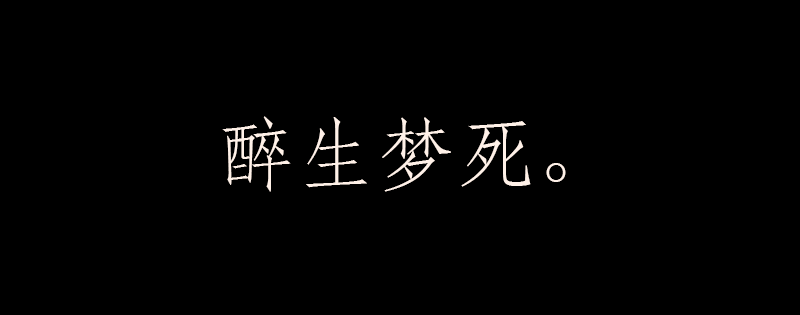

  “你不适合这个岗位！今天先这样！麻烦请你把下一位喊进来。”
  在一个窄小的会议室里，一位挺漂亮成熟的女面试官冰冷冷的对应试者赵铁柱说道。
  
  十分钟前，铁柱把自己的设计作品自信满满的交给面试官，想在这几十个应届生面试者竞争中脱颖而出，就可以在这家知名的游戏公司做自己感兴趣的设计师职业。
  
  “嗯...”，面试官很严肃的在笔记本上看着这些稿件。铁柱开始有些紧张了起来。
  “你的经历还不错，学校社团活动积极参与，作品也还挺多，看得出平时努力了。” 面试官接着说到，铁柱笑着点了点头，说: “哈哈，是的，我挺喜欢做这些。”
  
  “但是...”，铁柱最怕的两个字还是被面试官说了出来，“你是学计算机专业的，应该往自己的专业方向上努力，说实话，你这些作品在专业人士看来是不及格的。我想给你个建议，不要把兴趣等同于职业，不是每个人都能做自己最喜欢的工作，而且...”
  面试官的一番话，让铁柱沉默不语，陷入思考...
  
  铁柱的高考分数本来还不错，但是为了上一个不错的双一流大学，导致专业调剂到了软件工程专业，这个专业学费又高，学起来又难又枯燥乏味，一些譬如《数据库》、《数据结构》等计算机知识还算能听的进去，那些难的离谱的高数、物理、线代、电路等学科对他来说，简直是脱裤子放屁。
  
  他觉得大部分人在社会中不会需要这些东西，应该让专业的人去学专业的知识，而不是“折磨” 他们着一些非专业的人，反倒实践计算机知识的学习内容非常少，倔强和固执的性格使得铁柱不屑于学这些学科，对学校的教育打心眼里深深的不满，慢慢地，铁柱开始逃课，跟好朋友去网吧打上一下午的游戏，半夜休息后一觉又睡到中午下午，吃了盒饭再去玩，如此循环。
  
  铁柱虽然很聪明，但连课都不上，考试挂科概率就高了，这就是铁柱整日虚度光阴付出的代价。后来，铁柱虽然喜欢在学校社团做一些设计工作，会一些绘画，玩上了数位板和一些设计软件，破例当上学生会宣传部副部长（以往都是设计相关专业的同学任职）。但几个学期下来，挂掉的学科越来越多，铁柱不堪压力，甚至给学校副校长写了一封接近一万字的匿名信，痛斥了一波该专业的教育体系，但是他连校长到底有没有收到也不清楚，至今也未收到回信。
  
  有人把大学四年的每一学年分别形容做:
  
  

  这在用在铁柱的身上，算是比较贴切的，经历了“醉生梦”以后，大四那年，铁柱迎来“死”。
  
  所谓“死”，就是在读完十多年的教育后，最终还是一份像样的工作都没得到，还有人说：“毕业就是失业”。
  
  这对一个在被现代教育陪伴的了接近二十年的懵懂的大学生来说，如同“死”一般的沉重。能否死而复生，就看造化了。
  
  “你不适合这个岗位！今天先这样！” 面试官说了一些建议后得到这个结论，但赵铁柱没有任何反应，看似在想什么。
  “喂，赵同学！” 面试官看着眼神呆滞的铁柱，在他面前挥了挥手。
  
  “哦，不好意思老师，刚才走神了，你的话对我帮助很大，感谢！” 性格直率的铁柱知道自己在这个岗位上的希望没了以后，说完这句便跟面试官摇了了个拜拜的手势，转身就想走。
  
  “我加你个QQ吧，有什么需要帮助的可以说。”面试官喊住了铁柱，他或许在这个年轻人身上看到了当年自己的身影，迷茫而又坚决，萌生了同情心。
  
  “谢谢老师！哈哈。” 铁柱开心的加完面试官的QQ。就大步的走了出去，看了看在外面等着的很多设计院女同学，指着最漂亮的那个，“同学，到你了。” 于是铁柱就离开了这家用来社招的酒店。
  
  他应该没意识到，加的这个QQ或许能让他“死而复生”。
  
  > 未完待续，转载请注明出处。
  
  [上一篇：【序】]()
  
  

