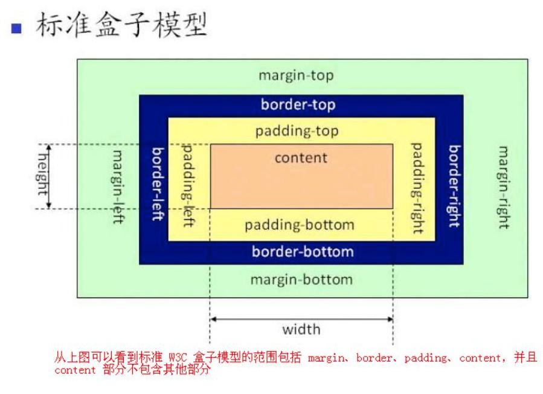
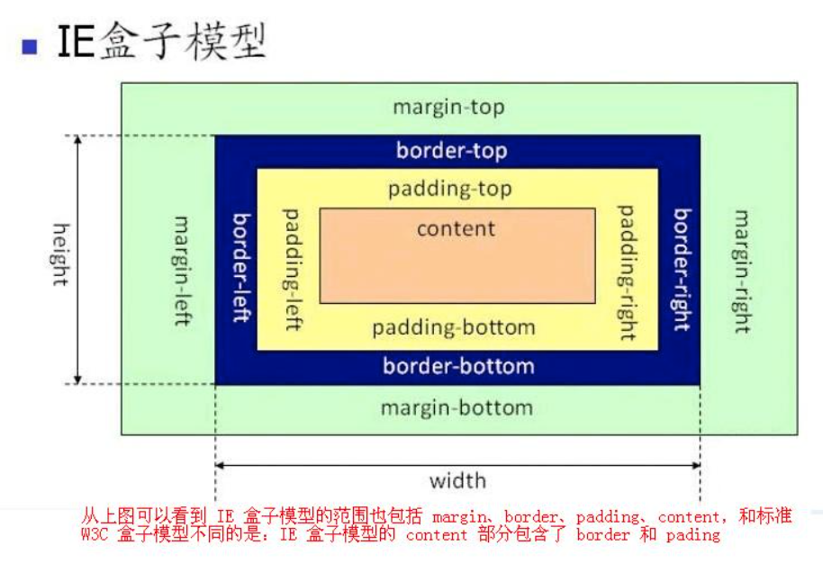

（吐血整理五万字干货，100道高频基础面试题）【番外01】无名面试集《烂俗前端》

> [《烂俗前端》](https://juejin.cn/column/7017997240325111845)是一部以前端为题材的小说，涉及讨论职业、社会、技术、情感等话题，正在更新中。

-------

> 之前吴明在对赵铁柱考验之前，扔了一份面试题集合让赵铁柱背，说：“你现在这个阶段，做到理解这些题还比较难，所以想过一些面试，就一个字，'背'！当然，死记硬背是在你尝试去理解未果的前提下。”，“另外，在这之前快速看完HTML/CSS/JS的基础内容, 比如两天看一遍。不然看面试题就是一脸懵逼。”
> 
> 有些同学总觉得光背这些不去理解的话没什么鸟用，能理解当然好，不能理解，背会了对面试官来说，那也是属于你的知识，学习态度也算ok。
> 
> 铁柱硬着头皮背了下来。下面是面试题正文。


作者：吴明

声明：本面试题非完全原创，作者负责筛选整理、编辑、补全解答、撰写。

主要读者人群：入门新人、社招面试者、初级前端。

-----

#### 01、什么是HTML语义化？
HTML语义化就是让页面内容结构化，它有如下优点:

1、易于用户阅读，样式丢失的时候能让页面呈现清晰的结构。

2、有利于SEO，搜索引擎根据标签来确定上下文和各个关键字的权重。

3、方便其他设备解析，如盲人阅读器根据语义> 渲染网页

4、有利于开发和维护，语义化更具可读性，代码更好维护，与CSS3关系更和谐

-------
#### 02、行内元素和块级元素?img算什么?行内元素怎么转化为块级元素?？	

行内元素：和有他元素都在一行上，高度、行高及外边距和内边距都不可改变，文字图片的宽度不可改变，只能容纳文本或者其他行内元素；其中img是行元素。

块级元素：总是在新行上开始，高度、行高及外边距和内边距都可控制，可以容纳内敛元素和其他元素。

行元素转换为块级元素方式：display：block；

----------


#### 03、请说出一些HTML5新增标签

能记多少记得少，太少用的我就不列出来了

**章节：**

+ `<section>` 定义文档中的一个章节，一般来说会有包含一个 heading
+ `<nav>`定义一个含有多个超链接的区域，这个区域包含转到其他页面，或者页面内部其他部分的链接列表
+ `<article>` 表示文档、页面、应用或网站中的独立结构，其意在成为可独立分配的或可复用的结构
+ `<aside>` 定义和页面内容联度较低的内容--如果被删除，剩下的内容仍然很合理
+ `<header>` 定义页面或章节的头部。它经常包含logo、页面标题和导航性的目录
+ `<footer>` 定义页面或章节的尾部。它经常包含版权信息、法律信息链接和反馈建议用的地址
+ `<main>` 定义文档中主要或重要的独一无二的内容。一个文档中不能出现一个以上的`<main>`标签


**文字形式：**
+ `<data>` 将一个指定内容和机器可读的翻译联系在一起。但如果内容是与time和date相关的，一定要使用`<time>`
+ `<time>` 代表日期和时间值；机器可读的等价形式通过datetime属性指定
+ `<mark>` 代表一段需要被高亮的引用文字，用来表示上下文的关联性
+ `<ruby>` 表示被ruby注释标记的文本，如中文汉字和它的拼音
+ `<bdi>` 代表需要脱离父元素文本方向的一段文本。它允许嵌入一段不同或未知文本方向格式的文本
+ `<wbr>` 代表建议换行，当文本太长需要换行时将会在此处添加换行符

**嵌入内容：**
+ `<embed>` 代表一个嵌入的外部资源，如应用程序或交互内容，换句话说，就是一个插件。如`<embed type="video/quicktime" src="movie.mov" width="640" height="480">`
+ `<video>` 代表一段视频及其视频文件和字幕，并提供了播放视频的用户界面
+ `<audio>` 代表一段声音或音频流。 `<audio>` 元素可以包含多个音频资源， 这些音频资源可以使用 `src` 属性或者`<source>` 元素来进行描述
+ `<source>` 为`<video>`或`<audio>`这类媒体元素指定媒体源
+ `<track>` 为`<video>`或`<audio>`这类媒体元素指定文本轨道（字幕）
+ `<canvas>` 代表位图区域，可以通过脚本在它上面实时呈现图形，如图表、游戏绘图等
+ `<svg>` 定义一个嵌入式矢量图
+ `<math>` 定义一段数学公式

**表单：**
+ `<datalist>` 代表提供给其他控件的一组预定义选项
+ `<keygen>` 代表一个密钥对生成器控件
+ `<output>` 代表计算值
+ `<meter>` 代表滑动条
+ `<progress>` 代表进度条，用来显示一项任务的完成进度

**交互元素：**
+ `<details>` 代表一个用户可以（点击）获取额外信息或控件的小部件。与summary配合使用
+ `<summary>` 代表 `<details>` 元素的综述或标题
+ `<menuitem>` 代表一个用户可以点击的菜单项
+ `<menu>` 代表菜单，呈现了一组用户可执行或激活的命令。这既包含了可能出现在屏幕顶端的列表菜单，也包含了那些隐藏在按钮之下、当点击按钮后显示出来的文本菜单。


----

#### 04、src和href的区别
+ src 是指向外部资源的位置，指向的内容会嵌入到文档当前标签所在的位置，如css、js脚本、img等
+ href 是指向网络资源所在的位置(的超链接)，如`<a href='xxx'></a>`


----

#### 05、前端页面有哪三层构成，分别是什么？作用是什么？
分成：结构层、表示层、行为层。
+ 结构层（structural layer）
由 HTML 或 XHTML 之类的标记语言负责创建。标签，也就是那些出现在尖括号里的单词，对网页内容的语义含义做出了描述，但这些标签不包含任何关于如何显示有关内容的信息。例如，P 标签表达了这样一种语义：“这是一个文本段。”

+ 表示层（presentation layer）
由 CSS 负责创建。 CSS 对“如何显示有关内容”的问题做出了回答。

+ 行为层（behaviorlayer）
负责回答“内容应该如何对事件做出反应”这一问题。这是 Javascript 语言和 DOM 主宰的领域。

----

#### 06、请写出至少5个HTML块元素标签
div、p、ul、li、table、h1、h2、h3 ... h6、form 等


----

#### 07、请写出至少5个HTML行内元素标签

span、a、i、label、img、input、button、textarea、select 等

----

#### 08、常用浏览器有哪些，内核都是什么？
常用浏览器有IE、火狐(firefox)、chrome、safari 、360、搜狗等
内核：
+ IE的是 Trident，新版微软浏览器Edge使用Webkit
+ 火狐的是 Gecko
+ safari 用的是 Webkit
+ 360和搜狗这些分极速模式和兼容模式，极速模式用的Webkit的内核，兼容模式用的Trident内核

----

#### 09、对 WEB 标准以及 W3C 的理解与认识
标签闭合、标签小写、不乱嵌套、提高搜索机器人搜索几率、使用外 链 css 和 js 脚本、结构行为表现的分离、文件下载与页面速度更快、内容能被更多的用户所访问、内容能被更广泛的设备所访问、更少的代码和组件，容易维 护、改版方便，不需要变动页面内容、提供打印版本而不需要复制内容、提高网站易用性。

----

#### 10、前端需要注意哪些 SEO
+ 合理的 title、description、keywords：搜索对着三项的权重逐个减小，title 值强调重点即可，重要关键词出现不要超过 2 次，而且要靠前，不同页面 title 要有所不同；description 把页面内容高度概括，长度合适，不可过分堆砌关键词，不同页面 description 有所不同；keywords 列举出重要关键词即可

+ 语义化的 HTML 代码，符合 W3C 规范：语义化代码让搜索引擎容易理解网页

+ 重要内容 HTML 代码放在最前：搜索引擎抓取 HTML 顺序是从上到下，有的搜索引擎对抓取长度有限制，保证重要内容一定会被抓取

+ 重要内容不要用 js 输出：爬虫不会执行 js 获取内容

+ 少用 iframe：搜索引擎不会抓取 iframe 中的内容

+ 非装饰性图片必须加 alt

+ 提高网站速度：网站速度是搜索引擎排序的一个重要指标

-----

#### 11、Canvas 和 SVG 有什么区别？

Canvas 和 SVG 都允许您在浏览器中创建图形，但是它们在根本上是不同的。

+ Canvas

通过 Javascript 来绘制 2D 图形。
是逐像素进行渲染的。
其位置发生改变，会重新进行绘制。

+ SVG
一种使用 XML 描述的 2D 图形的语言
SVG 基于 XML 意味着，SVG DOM 中的每个元素都是可用的，可以为某个元素附加 Javascript 事件处理器。
在 SVG 中，每个被绘制的图形均被视为对象。如果 SVG 对象的属性发生变化，那么浏览器能够自动重现图形。

+ 比较
**Canvas**
依赖分辨率
不支持事件处理器
弱的文本渲染能力
能够以 .png 或 .jpg 格式保存结果图像
最适合图像密集型的游戏，其中的许多对象会被频繁重绘

**SVG**
不依赖分辨率
支持事件处理器
最适合带有大型渲染区域的应用程序（比如谷歌地图）
复杂度高会减慢渲染速度（任何过度使用 DOM 的应用都不快）
不适合游戏应用

----

#### 12、meta viewport 原理是什么？

meta viewport 标签的作用是让当前 viewport 的宽度等于设备的宽度，同时不允许用户进行手动缩放

viewport的原理：移动端浏览器通常都会在一个比移动端屏幕更宽的虚拟窗口中渲染页面，这个虚拟窗口就是 viewport; 目的是正常展示没有做移动端适配的网页，让他们完整的展示给用户；

**解析：**
Viewport ：字面意思为视图窗口，在移动 web 开发中使用。表示将设备浏览器宽度虚拟成一个特定的值（或计算得出），这样利于移动 web 站点跨设备显示效果基本一致。移动版的 Safari 浏览器最新引进了 viewport 这个 meta tag，让网页开发者来控制 viewport 的大小和缩放，其他手机浏览器也基本支持。

在移动端浏览器当中，存在着两种视口，一种是可见视口（也就是我们说的设备大小），另一种是视窗视口（网页的宽度是多少）。
举个例子：如果我们的屏幕是 320 像素 * 480 像素的大小（iPhone4），假设在浏览器中，320 像素的屏幕宽度能够展示 980 像素宽度的内容。那么 320 像素的宽度就是可见视口的宽度，而能够显示的 980 像素的宽度就是视窗视口的宽度。

为了显示更多的内容，大多数的浏览器会把自己的视窗视口扩大，简易的理解，就是让原本 320 像素的屏幕宽度能够容下 980 像素甚至更宽的内容（将网页等比例缩小）。

----

#### 13、Viewport 属性值
+ width 设置 layout viewport 的宽度，为一个正整数，或字符串"width-device"
+ initial-scale 设置页面的初始缩放值，为一个数字，可以带小数
+ minimum-scale 允许用户的最小缩放值，为一个数字，可以带小数
+ maximum-scale 允许用户的最大缩放值，为一个数字，可以带小数
+ height 设置 layout viewport 的高度，这个属性对我们并不重要，很少使用
+ user-scalable 是否允许用户进行缩放，值为"no"或"yes", no 代表不允许，yes 代表允许这些属性可以同时使用，也可以单独使用或混合使用，多个属性同时使用时用逗号隔开就行了。

----

#### 14、为什么最好把 CSS 的`<link>`标签放在`<head></head>`之间？为什么最好把 JS 的`<script>`标签恰好放在`</body>`之前，有例外情况吗？

**把`<link>`放在`<head>`中**

把`<link>`标签放在`<head></head>`之间是规范要求的内容。此外，这种做法可以让页面逐步呈现，提高了用户体验。将样式表放在文档底部附近，会使许多浏览器（包括 Internet Explorer）不能逐步呈现页面。一些浏览器会阻止渲染，以避免在页面样式发生变化时，重新绘制页面中的元素。这种做法可以防止呈现给用户空白的页面或没有样式的内容。

**把`<script>`标签恰好放在`</body>`之前**

脚本在下载和执行期间会阻止 HTML 解析。把`<script>`标签放在底部，保证 HTML 首先完成解析，将页面尽早呈现给用户。

例外情况是当你的脚本里包含`document.write()`时。但是现在，document.write()不推荐使用。同时，将`<script>`标签放在底部，意味着浏览器不能开始下载脚本，直到整个文档（document）被解析。也许，对此比较好的做法是，`<script>`使用defer属性，放在`<head>`中。

----

#### 15、img 上 title 与 alt
title 指图片的信息、alt 指图片不显示时显示的文字

----

#### 16、DOM Tree是如何构建的？

**HTML 解释器**
HTML 解释器的工作就是将网络或者本地磁盘获取的 HTML 网页和资源从字节流解释成 DOM 树结构。

**JavaScript 的执行**
在 HTML 解释器的工作过程中，可能会有 JavaScript 代码需要执行，它发生在将字符串解释成词语之后、创建各种节点的时候。这也是为什么全局执行的 JavaScript 代码不能访问 DOM 的原因——因为 DOM 树还没有被创建完呢。

----

#### 17、video标签的几个个属性方法

+ src：视频的URL 
+ poster：视频封面，没有播放时显示的图片 
+ preload：预加载 
+ autoplay：自动播放 
+ loop：循环播放 
+ controls：浏览器自带的控制条 
+ width：视频宽度 
+ height：视频高度

----

#### 18、script标签中defer和async的区别

defer 浏览器指示脚本在文档被解析后执行，script被异步加载后并不会立即执行，而是等待文档被解析完毕后执行
+ `<script type="text/javascript" src="x.min.js" defer="defer"></script>`
+ defer只适用于外联脚本，如果script标签没有指定src属性，只是内联脚本，不要使用defer
+ 如果有多个声明了defer的脚本，则会按顺序下载和执行
+ defer脚本会在DOMContentLoaded和load事件之前执行

async 同样是异步加载脚本，区别是脚本加载完毕后立即执行，这导致async属性下的脚本是乱序的，对于script又先后依赖关系的情况，并不适用
+ `<script type="text/javascript" src="x.min.js" async="async"></script>`
+ 只适用于外联脚本，这一点和defer一致
+ 如果有多个声明了async的脚本，其下载和执行也是异步的，不能确保彼此的先后顺序
+ async会在load事件之前执行，但并不能确保与DOMContentLoaded的执行先后顺序

----

#### 19、meta标签常用属性
+ Keywords（关键词）

说明：告诉搜索引擎你网页的关键字（keywords）
使用方法：`<meta name="keywords" content="标签,属性,seo优化">`

 
+ Robots (机器人向导)

说明：Robots用来告诉搜索机器人页面需要或者不需要索引。Content的參数有all、none、index、noindex、follow、nofollow。默认是all。

使用方法：`<meta name="robots" content="All|None|Index|Noindex|Follow|Nofollow">`
  + all：文件将被检索，且页面上的链接能够被查询。
  + none：文件将不被检索。且页面上的链接不能够被查询。(和 "noindex, no follow" 起同样作用)
  + index：文件将被检索；（让robot/spider登录）
  + follow：页面上的链接能够被查询；
  + noindex：文件将不被检索，但页面上的链接能够被查询；(不让robot/spider登录)
  + nofollow：文件将不被检索，页面上的链接能够被查询。(不让robot/spider顺着此页的连接往下探找) 

+ viewport（视窗/移动端）**

说明：viewport 是用户网页的可视区域，即“视区”。

使用方法：`<meta name="viewport" content="width=device-width, initial-scale=1.0">`

 + width：控制 viewport 的大小，可以指定的一个值，如 600，或者特殊的值，如 device-width 为设备的宽度（单位为缩放为 100% 时的 CSS 的像素）。
 + height：和 width 相对应，指定高度。
 + initial-scale：初始缩放比例，也即是当页面第一次 load 的时候缩放比例。
 + maximum-scale：允许用户缩放到的最大比例。
 + minimum-scale：允许用户缩放到的最小比例。
 + user-scalable：用户是否可以手动缩放。


+ http-equiv="X-UA-Compatible" （这是一个文档兼容模式的定义）

使用： `<meta http-equiv = "X-UA-Compatible" content = "chrome=1" >`

X-UA-Compatible：是IE8新加的一个设置，对于IE8以下的浏览器是不识别的，通过在meta中设置X-UA-Compatible的值，可以指定网页的兼容性模式设置。

< meta http-equiv = "X-UA-Compatible" content = "chrome=1" >用以声明当前页面用chrome内核来渲染。

Edge模式告诉IE以最高级 模式渲染文档，也就是任何IE版本都以当前版本所支持的最高级标准模式渲染，避免版本升级造成的影响。

 

+ renderer（指定双核浏览器默认以何种方式渲染页面）

使用：`<meta name="renderer" content="webkit">`

这段代码意思：强制浏览器使用Webkit内核。

若页面需默认用极速核，增加标签：`<meta name="renderer" content="webkit">`
若页面需默认用ie兼容内核，增加标签：`<meta name="renderer" content="ie-comp">`
若页面需默认用ie标准内核，增加标签：`<meta name="renderer" content="ie-stand">`


**举例说明**


a. 设置屏幕宽度为设备宽度，禁止用户手动调整缩放
`<meta name="viewport" content="width=device-width,user-scalable=no" />`

b. 设置屏幕密度为高频，中频，低频自己主动缩放，禁止用户手动调整缩放)
`<meta name="viewport" content="width=device-width, target-densitydpi=high-dpi, initial-scale=1.0, minimum-scale=1.0, maximum-scale=1.0, user-scalable=no"/>`

另外iOS 7.1的Safari为meta标签新增minimal-ui属性，在网页载入时默认隐藏地址栏与导航栏。

----

#### 20、HTML5 为什么只需要写`<!DOCTYPE HTML>`，而不需要引入 DTD？
HTML5 不基于 SGML，因此不需要对 DTD 进行引用，但是需要 DOCTYPE 来规范浏览器的行为（让浏览器按照它们应该的方式来运 行）。
而 HTML4.01 基于 SGML ，所以需要对 DTD 进行引用，才能告知浏览器文档所使用的文档类型。

----
#### 21、DTD 介绍
DTD（ Document Type Definition 文档类型定义）是一组机器可读的规则，它们定义 XML 或 HTML 的特定版本中所有允许元 素及它们的属性和层次关系的定义。在解析网页时，浏览器将使用这些规则检查页面的有效性并且采取相应的措施。
DTD 是对 HTML 文档的声明，还会影响浏览器的渲染模式（工作模式）。

----
#### 22、简述前端优化的方式

+ 尽量减少HTTP请求次数
+ 减少DNS查找次数
+ 避免跳转
+ 可缓存的AJAX
+ 推迟加载内容
+ 预加载
+ 减少DOM元素数量
+ 根据域名划分页面内容
+ 使iframe的数量最小
+ 不要出现404错误
+ 使用内容分发网络
+ 为文件头指定Expires或Cache-Control 13、Gzip压缩文件内容
+ 配置ETag
+ 尽早刷新输出缓冲
+ 使用GET来完成AJAX请求
+ 把样式表置于顶部
+ 避免使用CSS表达式（Expression）
+ 使用外部JavaScript和CSS
+ 削减JavaScript和CSS
+ 用`<link>`代替@import
+ 避免使用滤镜
+ 把脚本置于页面底部
+ 剔除重复脚本

-----

#### 23、CSS盒子模型
盒模型分为`标准盒模型`和`怪异盒模型(IE模型)`

```css
/* 使用css指定某个元素的盒子模型类型 */
box-sizing：content-box;   /*标准盒模型*/
box-sizing：border-box;    /*怪异盒模型*/
```






上图显示：

在CSS盒子模型规定了元素处理元素的几种方式：

+ width和height：内容的宽度、高度（不是盒子的宽度、高度）。
+ padding：内边距。
+ border：边框。
+ margin：外边距。

**CSS盒模型和IE盒模型的区别：**

在 标准盒子模型中，width 和 height 指的是内容区域的宽度和高度。增加内边距、边框和外边距不会影响内容区域的尺寸，但是会增加元素框的总尺寸。

IE盒子模型中，width 和 height 指的是内容区域+border+padding的宽度和高度。

-----

#### 24、为什么要初始化CSS样式。

因为浏览器的兼容问题，不同浏览器对有些标签的默认值是不同的，如果没对CSS初始化往往会出现浏览器之间的页面显示差异。

-----

#### 25、如何让一个div 上下左右居中?

```html
<div class="div1"></div> 
```

```css
/*给出三种css答案，实际上还有更多方法*/

/*方法一*/
.div1{
	width:400px;  
	height:400px;
	border:#CCC 1px solid;  
	/*下面几个才是居中的关键属性*/
	position:absolute;  
	left:50%;
	top:50%;   
	transform: translate(-50%,-50%); 
}  

/*方法二*/
.div1{ 
	width:400px;  
	height:400px;  
	border:#CCC 1px solid;  
	/*下面几个才是居中的关键属性*/
	position: absolute;  
	left:0;  
	top: 0;  
	bottom: 0;  
	right: 0;  
	margin: auto; 
}

/*方法三*/
.div1{ 
	width:400px;  
	height:400px;  
	border:#CCC 1px solid;
	/*下面几个才是居中的关键属性*/
	position: absolute;  
	left: 50%;  top:50%;  
	margin-left:-200px;  
	margin-top: -200px;  
}
```

-----

#### 26、简述css hack?

由于不同的浏览器，比如Internet Explorer 6,Internet Explorer 7,Mozilla Firefox等，对CSS的解析认识不一样，因此会导致生成的页面效果不一样，得不到我们所需要的页面效果。

这个时候我们就需要针对不同的浏览器去写不同的CSS，让它能够同时兼容不同的浏览器，能在不同的浏览器中也能得到我们想要的页面效果。

这个针对不同的浏览器写不同的CSS code的过程，就叫CSS hack,也叫写CSS hack。


CSS hack是通过在CSS样式中加入一些特殊的符号，让不同的浏览器识别不同的符号（什么样的浏览器识别什么样的符号是有标准的，CSS hack就是让你记住这个标准），以达到应用不同的CSS样式的目的，比如

```
.kwstu{width:300px;_width:200px;}，

```
一般浏览器会先给元素使用width:300px;的样式，紧接着后面还有个`_width:200px;`,由于下划线`_width`只有IE6可以识别，所以此样式在IE6中实际设置对象的宽度为200px，后面的把前面的给覆盖了，而其他浏览器不识别`_width`不会执行`_width:200px;`这句样式，所以在其他浏览器中设置对象的宽度就是300px;

-----

#### 27、CSS 选择器有哪些？

+ id选择器（ #myid）
+ 类选择器（.myclassname）
+ 标签选择器（div, h1, p）
+ 相邻选择器（h1 + p）
+ 子选择器（ul > li）
+ 后代选择器（li a）
+ 通配符选择器（ * ）
+ 属性选择器（a[rel = “external”]）
+ 伪类选择器（a:hover, li:nth-child）

-----

#### 28、css选择器的权重(优先级)
!important > 行内样式 > #id > .class > 元素和伪元素 > * > 继承 > 默认

-----

#### 29、CSS3新特性
+ 新增选择器 `p:nth-child(n){color: rgba(255, 0, 0, 0.75)}`
+ 弹性盒模型 `display: flex`;
+ 多列布局 `column-count: 5`;
+ 媒体查询 `@media(max-width: 480px) {.box: {column-count: 1;}}`
+ 个性化字体 `@font-face{font-family:BorderWeb;src:url(BORDERW0.eot)；}`
+ 颜色透明度 `color: rgba(255, 0, 0,0.75)；`
+ 圆角 `border-radius: 5px;`
+ 渐变 `background:linear-gradient(red, green, blue)；`
+ 阴影 `box-shadow:3px 3px 3px rgba(0, 64, 128, 0.3)；`
+ 倒影 `box-reflect: below 2px;`
+ 文字装饰 `text-stroke-color: red;`
+ 文字溢出 `text-overflow:ellipsis;`
+ 背景效果 `background-size: 100px 100px;`
+ 边框效果 `border-image:url(bt_blue.png) 0 10;`

**转换**
+ 旋转 `transform: rotate(20deg)；`
+ 倾斜 `transform: skew(150deg,-10deg)；`
+ 位移 `transform:translate(20px, 20px)；`
+ 缩放 `transform: scale(.5)；`
+ 平滑过渡 `transition: all .3s ease-in .1s;`
+ 动画 `@keyframes anim-1 {50% {border-radius: 50%;}} animation: anim-1 1s;`

-----

#### 30、CSS隐藏元素的几种方法

+ `opacity: 0;` 元素本身依然占据它自己的位置并对网页的布局起作用。它也将响应用户交互;

+ `visibility: hidden;` 与 opacity 唯一不同的是它不会响应任何用户交互。此外，元素在读屏软件中也会被隐藏;

+ `display: none;` 设为 none 任何对该元素直接打用户交互操作都不可能生效。此外，读屏软件也不会读到元素的内容。这种方式产生的效果就像元素完全不存在;


-----

#### 31、css清除浮动的几种方式？

+ 父级div定义 height
+ 结尾处加空div标签 clear:both
+ 父级div定义 伪类:after 和 zoom
+ 父级div定义 overflow:hidden
+ 父级div定义 overflow:auto
+ 父级div 也一起浮动
+ 父级div定义 display:table

-----

#### 32、谈谈css预处理器的理解
CSS 预处理器定义了一种新的语言，其基本思想是，用一种专门的编程语言，为 CSS 增加了一些编程的特性，将 CSS 作为目标生成文件，然后开发者就只要使用这种语言进行编码工作。

CSS 预处理器用一种专门的编程语言，进行 Web 页面样式设计，然后再编译成正常的 CSS 文件，以供项目使用。CSS 预处理器为 CSS 增加一些编程的特性，无需考虑浏览器的兼容性问题

通俗的说，“CSS 预处理器用一种专门的编程语言，进行 Web 页面样式设计，然后再编译成正常的 CSS 文件，以供项目使用。CSS 预处理器为 CSS 增加一些编程的特性，无需考虑浏览器的兼容性问题”。

例如你可以在 CSS 中使用变量、简单的逻辑程序、函数（如右侧代码编辑器中就使用了变量$color）等等在编程语言中的一些基本特性，可以让你的 CSS 更加简洁、适应性更强、可读性更佳，更易于代码的维护等诸多好处。

CSS 预处理器技术已经非常的成熟，而且也涌现出了很多种不同的 CSS 预处理器语言，比如说：

+ Sass（SCSS）
+ LESS
+ Stylus
+ Turbine
+ Swithch CSS
+ CSS Cacheer

到目前为止，在众多优秀的 CSS 预处理器语言中就属 Sass、LESS 和 Stylus 使用较为广泛。

**优点：**
1、CSS变得更易于维护。

2、易于编写嵌套选择器。

3、用于一致主题的变量。可以跨不同项目共享主题文件。

4、Mixins生成重复的CSS。

5、诸如循环，列表和映射之类的Sass功能可以使配置更容易且更省力。

6、将您的代码分成多个文件。CSS文件也可以拆分，但是这样做需要HTTP请求才能下载每个CSS文件。


**缺点：**
1、需要进行预处理的工具。重新编译时间可慢一些。

2、不编写当前和潜在可用的CSS。例如，通过将诸如 postcss-loader之类的内容 与 webpack一起使用，您可以编写可能与将来兼容的CSS，从而使您可以使用CSS变量（而不是Sass变量）之类的东西

-----

#### 33、请解释一下CSS3的flexbox（弹性盒布局模型）,以及适用场景？

该布局模型的目的是提供一种更加高效的方式来对容器中的条目进行布局、对齐和分配空间。在传统的布局方式中，block 布局是把块在垂直方向从上到下依次排列的；而 inline 布局则是在水平方向来排列。弹性盒布局并没有这样内在的方向限制，可以由开发人员自由操作。
试用场景：弹性布局适合于移动前端开发，在Android和ios上也完美支持。

-----

#### 34、CSS 单位
最常用的单位：%百分比，px，rem，vh，vw

有传统的单位如：% 百分比、cm 厘米、mm 毫米、px 像素（计算机屏幕上的一个点）、in 英寸、pt 磅，此外还有：
+ rgb(x,x,x) rgb(x%,x%,x%) #rrggbb（十六进制）
+ em：1em 等于当前字体尺寸（继承父元素的字体尺寸）
+ rem：r 为 root，1rem 等于根元素字体尺寸（继承 html 的字体尺寸）
+ vh：1vh 等于可视窗口高度的 1/100
+ vw: 1vw 等于可视窗口宽度的 1/100
+ vmin：可视窗口宽高更小的值的 1/100
+ vmax：可视窗口宽高更大的值的 1/100
+ ex：当前字体的一个 x-height，一般为当前字体的一个 em 的一半，因为一个 'x' 字母一般为字体大小的一半
+ ch：设置 width:40ch 表示这个宽度可以容纳 40 个特定字体的字符

-----

#### 35、有哪些方式可以对一个DOM设置它的CSS样式？

+ 外部样式表。使用`<link>`引入一个外部CSS文件；
+ 内部样式表。将CSS代码放在`<head>`标签内部；
+ 内联样式，将CSS样式直接定义在HTML元素内部；

-----

#### 36、知道css有个content属性吗？有什么用？

CSS的content属性专门应用在before/after伪元素上，用来插入生成内容。最常见的应用是利用伪类清除浮动：
```css
/*一种常见利用伪类清除浮动的代码*/
 .clearfix:after {   
    content:".";       /*这里利用到了content属性*/
    display:block;    
    height:0;   
    visibility:hidden;    
    clear:both; 
}   
  
.clearfix {    
    *zoom:1;    
}
```
after伪元素通过content在元素的后面生成一个点的块级元素，再利用clear: both清除浮动。 

-----

#### 37、display 有哪些值？各有何作用？
常用的有以下（还有别的值，相对少用）：
+ block 元素按块类型元素一样显示。
+ none 缺省值。元素按行内元素类型一样显示。
+ inline 元素按行内元素类型一样显示。
+ inline-block 元素按行内元素一样显示，但其内容像块类型元素一样显示。
+ list-item 元素按块类型元素一样显示，并添加样式列表标记。

-----

#### 38、position 中的 relative 和 absolute 定位的区别？
+ absolute 生成绝对定位的元素，相对于 static 定位以外的第一个父元素进行定位。
+ fixed 生成绝对定位的元素，相对于浏览器窗口进行定位。
+ relative 生成相对定位的元素，相对于其正常位置进行定位。
+ static 默认值。没有定位，元素出现在正常的流中（忽略 top, bottom, left, right z-index 声明）。
+ inherit 规定从父元素继承 position 属性的值。

-----

#### 39、用纯 CSS 创建一个三角形的原理是什么？

把上、左、右三条边隐藏掉（颜色设为 transparent）

```css
#demo {
    width:0;
    height: 0;
    border-width: 20px;
    border-style: solid;
    border-color: transparent transparent red transparent;
}
```

-----

#### 40、什么是BFC？怎么创建BFC？

BFC(block formatting context)指块级格式化上下文。

BFC是一个独立的渲染区域，只有block-level box参与，它规定了内部的block-level box如何布局，并且与这个区域外部毫不相干。
    
BFC就是页面上的一个隔离的独立容器，容器里面的子元素不会影响到外面的元素，反之也如此，包括浮动和外边距合并等等，有了这个特性我们布局的时候就不会出现意外情况了

**哪些元素会产生BFC**
display属性为block、list-item、table的元素，会产生BFC。（最常用的就是块级元素）

**什么情况下会触发BFC**
+ 设置了float属性，并且不为none
+ position属性为absolute或fixed
+ display为inline-block、table-cell、table-caption、flex、inline-flex
+ overflow属性不为visible

**BFC元素所具有的特性**
+ 在BFC中，盒子从顶端开始垂直地一个接一个的排列；
+ 盒子垂直方向的距离由margin决定，属于同一个BFC的盒子的margin会重叠；
+ 在BFC中，每一个盒子的左边缘会触碰到父容器的左边缘内部，也就是说在没有margin和padding时，父border的内边和子border的外边重叠；
+ BFC的区域不会与浮动盒子产生交集，而是紧贴浮动边缘；
+ 如果父盒子没有设置高度，但子盒子中有浮动元素，那么在计算BFC的高度时， 会计算上浮动盒子的高度。

-----

#### 41、什么叫优雅降级和渐进增强？

**渐进增强 progressive enhancement：**

针对低版本浏览器进行构建页面，保证最基本的功能，然后再针对高级浏览器进行效果、交互等改进和追加功能达到更好的用户体验。

**优雅降级 graceful degradation：**

一开始就构建完整的功能，然后再针对低版本浏览器进行兼容。

**区别：**

a. 优雅降级是从复杂的现状开始，并试图减少用户体验的供给

b. 渐进增强则是从一个非常基础的，能够起作用的版本开始，并不断扩充，以适应未来环境的需要

c. 降级(功能衰减)意味着往回看;而渐进增强则意味着朝前看，同时保证其根基处于安全地带

-----

#### 42、什么是响应式设计？

它是关于网站的制作或网页制作的工作。不同的设备有不同的尺寸和不同的功能。响应式设计是让所有的人能在这些设备上让网站运行正常。一部分是媒体查询和不同的视觉效果。一部分是不同的资源（如不同的Javascript来处理触摸与点击自动适应屏幕的对比）

-----

#### 43、png，jpg，jpeg，gif，webp，bmp等图片格式？有哪些优缺点？

首先jpg和jpeg就可以理解为同一个东西，这里就只讲jpg。

+ jpg：

优点：就是图片压缩后不至于太失真，色彩还原度较高

缺点：无法做透明图，就是没办法抠出一个图片

适用场景：基本上网页上的大图都是jpg

+ png：

优点：能做透明图

缺点：体积大，如果色彩较多的，是同等jpg的5-6倍

适用场景：网页上的图标，一般都是用png24，png8有点半透明


+ gif：

优点：支持动画

缺点：颜色种类有限

适用场景：各种小动画。。


+ webp:

优点：简单说就是压得更小，图片质量却不差

缺点：兼容性差，IE和Safari不支持

适用场景：指定浏览器环境下可用

 

+ bmp：

优点：高质量图片

缺点：太大了

适用场景：Windows桌面壁纸

-----

#### 44、聊聊Base 64图片

优点：减少http请求，因为图片被base64编码进了 css文件中（一般是进css文件）

缺点：如果加进css文件中去，css体积会增大，而且会阻塞渲染，（普通图片加载是异步的）

适用场景：适用于一些体积较小的图片

-----

#### 45、浏览器如何解析css选择器？

浏览器会『从右往左』解析CSS选择器。
我们知道DOM Tree与Style Rules合成为 Render Tree，实际上是需要将Style Rules附着到DOM Tree上，
因此需要根据选择器提供的信息对DOM Tree进行遍历，才能将样式附着到对应的DOM元素上。
以下这段css为例
```css
.mod-nav h3 span {font-size: 16px;}
```
若从左向右的匹配，过程是：

从 .mod-nav 开始，遍历子节点 header 和子节点 div
然后各自向子节点遍历。在右侧 div 的分支中
最后遍历到叶子节点 a ，发现不符合规则，需要回溯到 ul 节点，再遍历下一个 li-a，一颗DOM树的节点动不动上千，这种效率很低。

如果从右至左的匹配：

先找到所有的最右节点 span，对于每一个 span，向上寻找节点 h3
由 h3再向上寻找 class="mod-nav" 的节点
最后找到根元素 html 则结束这个分支的遍历。


后者匹配性能更好，是因为从右向左的匹配在第一步就筛选掉了大量的不符合条件的最右节点（叶子节点）；而从左向右的匹配规则的性能都浪费在了失败的查找上面

-----

#### 46、谈谈对媒体查询的理解
**什么是媒体查询**
媒体查询由媒体类型和一个或多个检测媒体特性的条件表达式组成。媒体查询中可用于检测的媒体特性有：width、height和color（等）。使用媒体查询可以在不改变页面内容的情况下，为特性的一些输出设备定制显示效果。通常用于多中设备适配屏幕。

**媒体查询语法**
如下面的例子，根据浏览器窗口大小的改变，页面颜色就会改变。
```css
/*如果设备如果满足多个条件，以后面写的为准*/


/*屏幕尺寸最大为960px的屏幕下 */
@media screen and (max-width: 960px){
    body{
    background-color:#FF6699
    }
}

/*屏幕尺寸最大为768px的屏幕下 */
@media screen and (max-width: 768px){
    body{
    background-color:#00FF66;
    }
}


/*屏幕尺寸最大为550px的屏幕下 */
@media screen and (max-width: 550px){
    body{
    background-color:#6633FF;
    }
}

/*屏幕尺寸最大为320px的屏幕下 */
@media screen and (max-width: 320px){
    body{
    background-color:#FFFF00;
    }
}
```

-----

#### 47、flex弹性布局的使用

**1.设置盒子的display属性为flex，或者line-flex，其对应还有六个css属性，分别为：**

+ flex-direction：设置子元素的排列方式（row，column，row-reverse，column-reverse）

+ flex-warp：设置子元素的是否换行（nowarp，warp，warp-reverse）

+ flex-flow：flex-direction和flex-warp的缩写，默认为row nowarp

+ **justify-content**：设置子元素的水平排列方式（flex-start，flex-end，center，span-around，span-between）

+ **align-items**：设置子元素的垂直方式（flex-start，flex-end，center，stretch，baseline）

+ align-content：设置多个轴线的排列方式（flex-start，flex-end，center，spand-around，spand-between，stretch）


**2. 对应的子元素项目也拥有自身的六个css属性，分别为：**

+ order：设置元素的排列权重 值越大越在后

+ flex-grow：设置元素的放大比例

+ flex-shrink：设置元素的缩小比例

+ flex-basis：设置多余空间项目主轴所占比例空间

+ **flex**：flex-grow和flex-shrink和flex-basis的缩写方式 默认为0 1 auto

+ align-self：设置子元素自己的垂直排列方式，默认为盒子的align-items的值

设置flex布局后，子元素的float，clear，vertical-align都无效

-----

#### 48、 CSS优化、提高性能的方法有哪些？
+ 避免过度约束
+ 避免后代选择符
+ 避免链式选择符
+ 使用紧凑的语法
+ 避免不必要的命名空间
+ 避免不必要的重复
+ 最好使用表示语义的名字。一个好的类名应该是描述他是什么而不是像什么
+ 避免`!important`，可以选择其他选择器
+ 尽可能的精简规则，你可以合并不同类里的重复规则
+ 修复解析错误
+ 避免使用多类选择符
+ 移除空的css规则
+ 正确使用display的属性：由于display的作用，某些样式组合会无效，徒增样式体积的同时也影响解析性能。
 + display:inline后不应该再使用width、height、margin、padding以及float。
 + display:inline-block后不应该再使用float。
 + display:block后不应该再使用vertical-align。
 + display:table-*后不应该再使用margin或者float。
+ 不滥用浮动：虽然浮动不可避免，但不可否认很多css bug是由于浮动而引起。
+ 不滥用web字体
+ 对于中文网站来说Web Fonts可能很陌生，国外却很流行。web fonts通常体积庞大，而且一些浏览器在下载web fonts时会阻塞页面渲染损伤性能。
+ 不声明过多的font-size：这是设计层面的问题，设计精良的页面不会有过多的font-size声明。
+ 不在选择符中使用ID标识符，主要考虑到样式重用性以及与页面的耦合性。
+ 不给h1~h6元素定义过多的样式
+ 全站统一定义一遍heading元素即可，若需额外定制样式，可使用其他选择符作为代替。
+ 不重复定义h1~h6元素
+ 值为0时不需要任何单位
+ 标准化各种浏览器前缀：通常将浏览器前缀置于前面，将标准样式属性置于最后.
+ 使用CSS渐变等高级特性，需指定所有浏览器的前缀
+ 避免让选择符看起来像正则表达式
+ CSS3添加了一些类似~=等复杂属性，也不是所有浏览器都支持，需谨慎使用。
+ 遵守盒模型规则（Beware of broken box models）

-----

#### 49、一个满屏“品”字布局如何设计？

+ 上面的 div 宽100%
+ 下面的两个 div 分别宽50%，然后用 float 或者 inline 使其不换行

-----

#### 50、li 与 li 之间有看不见的空白间隔是什么原因引起的？有什么解决办法？
行框的排列会受到中间空白（回车空格）等的影响，因为空格也属于字符,这些空白也会被应用样式，占据空间，所以会有间隔，把字符大小设为0，就没有空格了。
解决方法：

+ 可以将`<li>`代码全部写在一排
+ 浮动li中`float：left`
+ 在ul中用`font-size：0`（谷歌不支持）；
+ 可以 `ul{letter-spacing: -4px;};li{letter-spacing: normal;}`

-----

#### 51、javascript typeof返会的数据类型有哪些
object, string, undefined, number, function, boolean

js的基本数据类型：
string, number, boolean, undefined, null

数据类型检测:
typeof 对于基本数据类型来说，除了 null 都可以显示正确的类型，typeof 对于对象来说，除了函数都会显示 object

```javascript
typeof 5 // 'number'
typeof '5' // 'string'
typeof undefined // 'undefined'
typeof false// 'boolean'
typeof Symbol() // 'symbol'
console.log(typeof null)  //object
console.log(typeof NaN)   //number

typeof [] // 'object'
typeof {} // 'object'
typeof console.log // 'function'
```

instanceof通过原型链来判断数据类型的
```javascript
p1 = new Person()
p1 instanceof Person // true
```

Object.prototype.toString.call()可以检测所有的数据类型，算是一个比较完美的方法了。

```javascript
var obj={}
var arr=[]
console.log(Object.prototype.toString.call(obj))    //[object Object]
console.log(Object.prototype.toString.call(arr))    //[object Array]
```

-----
#### 52、知道Array对象的哪些方法？

其中 push/pop/shift/unshift 初级考的最多。

##### 不改变array的方法
+ indexOf() 和 lastIndexOf()
 + indexof() : 返回元素在数组的第一次出现的索引，从0开始。若数组不存在该元素，则返回-1。
```javascript
var arr = [1, 2, 2];
arr.indexOf(1); //0
arr.indexOf(10); //-1
```

 + lastIndexOf(): 返回元素在数组最后一次出现的索引，如果没有出现则返回-1.
```javascript
var arr = [1, 2, 2];
arr.lastIndexOf(2); //2
arr.lastIndexOf(10); //-1
```

+ slice()方法
与字符串的substring()方法一样，截取数组的一部分，返回一个新的数组。

 + slice(start)索引从start开始截取
```javascript
var arr = [1, 2, 2, 5, 6];
arr.slice(2) // [2, 5, 6]
```
 + slice(start,end)索引从start开始到索引end结束。通常，接受2个参数作为一个左闭右开区间，即包括开始索引位置的元素，但不包括结束索引位置的元素。
```javascript
var arr = [1, 2, 2, 5, 6];
arr.slice(1,3) // [2, 2]
```

 + slice()没有参数，则是复制整个数组。
```javascript
var arr = [1, 2, 2, 5, 6];
arr.slice();
```

+ concat()：合并数组。
把当前的数组和另一个数组连接起来，并返回一个新的数组。

 + 方法的参数可以有多个，也可以任意任意类型，数值、字符串、布尔值、数组、对象都可以，参数会被被添加到新的数组中。
```javascript
var arr1 =  [1, 2, 3,4,5,6];
var arr2 = ['a','b','c'];
var arr3 = arr1.concat(arr2);
arr3;   //[1, 2, 3, 4, 5, 6, "a", "b", "c"]
```
 + 注意，如果参数是数组, 会被拉平一次，即数组会被拆开来，加入到新的数组中。具体看示例：
```javascript
var arr1 = [1, 2, 3];
var arr2 = arr1.concat(66,'abc',true,[10,20],[30,[31,32]],{x:100});
arr2;  //[1, 2, 3, 66, "abc", true, 10, 20, 30, [31,32], {x:100}]
```

+ join(): 转成字符串。
它会把当前Array的每个元素都用指定的字符串连接起来，然后返回连接后的字符串。

 + 参数是用来指定连接的字符串。见示例代码：
```javascript
var arr = [1, 2, 3];
arr.join('*')   //"1*2*3"
```
 + 如果没有指定参数，默认是用 "," 连接。
```javascript
var arr = [1, 2, 3];
arr.join()   //"1,2,3"
```

+ toString(): 返回数组的字符串形式
```javascript
var arr = [1, 2, 3];
arr.toString() // "1,2,3"

```

+ map():
 + 对数组的所有成员依次调用一个函数，返回值是一个新数组。
```javascript
arr.map(function(elem, index, arr) {
    return elem * index;
}); 
//[0, 2, 6]
```

 + map方法接受一个函数作为参数,该函数调用时，map方法会将其传入3个参数，分别是当前成员、当前位置和数组本身(后2个参数可选)。
```javascript
arr.map(function(elem, index, arr) {
    return elem * index;
}); 
//[0, 2, 6]
```

 + map方法还可以接受第2个参数，表示回调函数执行时this所指向的对象。

+ forEach():
与map方法很相似，也是遍历数组的所有成员，执行某种操作。注意：forEach方法一般没有返回值

```javascript
var arr = [1, 2, 3];
function log(element, index, array) {
    console.log('[' + index + '] = ' + element);
}
arr.forEach(log);
// [0] = 1
// [1] = 2
// [2] = 3
```

+ filter(): 删选

```javascript
var arr = [1, 2, 3, 4, 5];
arr.filter(function (elem, index, arr) {
  return index % 2 === 1;
});
//[2, 4]
```

+ some()和every()
类似“断言”（assert），用来判断数组成员是否符合某种条件。

 + 接受一个函数作为参数，所有数组成员依次执行该函数，返回一个布尔值。该函数接受三个参数，依次是当前位置的成员、当前位置的序号和整个数组。
  + some方法是只要有一个数组成员的返回值是true，则整个some方法的返回值就是true，否则false。
```javascript
var arr = [1, 2, 3, 4];
arr.some(function (elem, index, arr) {
  return elem >= 3;
});
// true
```
 + every方法则是所有数组成员的返回值都是true，才返回true，否则false。
```javascript
var arr = [1, 2, 3, 4];
arr.every(function (elem, index, arr) {
  return elem >= 3;
});
// false
```

 + 注意，对于空数组，some方法返回false，every方法返回true

+ reduce()和reduceRight():
依次处理数组的每个成员，最终累计为一个值。

 + reduce是从左到右处理（从第一个成员到最后一个成员）
```javascript
arr = [1, 2, 3]
arr.reduce(function(x, y){
  console.log(x, y)
  return x + y;
});
// 1 2
// 3 3
// 6
```

 + reduceRight则是从右到左处理（从最后一个成员到第一个成员）
```javascript
arr.reduceRight(function(x, y){
  console.log(x, y)
  return x + y;
});
// 3 2
// 5 1
// 6
```

##### 改变原数组的方法
+ push():
向数组的末尾添加若干元素。返回值是改变后的数组长度。

```javascript
var arr = [1, 2];
arr.push(3) ;// 3
arr; //  [1, 2, 3]
arr.push('b','c'); //5
arr; //[1, 2, 3, "b", "c"]
arr.push([10,20]); //6
arr; //[1, 2, 3, "b", "c", [10,20]]
```

+ pop()
删除数组最后一个元素。返回值是删除的元素。
```javascript
var arr =[1, 2, 3, "b", "c", [10,20]];
arr.pop(); //[10, 20]
arr;  // [1, 2, 3, "b", "c"]
```

+ unshift()
向数组头部添加若干元素。返回值是改变后的数组长度。
```javascript
var arr = [1, 2];
arr.unshift(3,4 );  //4
arr;  // [3, 4, 1, 2]
```

+ shift()
删除数组第一个元素。返回值是删除的元素
```javascript
var arr = ['a', 'b', 1, 2];
arr.shift(); //'a'
arr;  //['b', 1, 2]
```

+ sort()
数组排序。默认是将所有元素转换成字符串，再按字符串Unicode码点排序。返回值是新的数组。
```javascript
var arr = [1, 2, 12, 'a', 'b', 'ab', 'A', 'B']
arr.sort();  //[1, 12, 2, "A", "B", "a", "ab", "b"] 注意：12排在了2的前面
```

如果元素都是数字，要按从小到大排序，可以传入一个回调函数作为参数。
```javascript
var arr = [1, 2, 12, 100]

arr.sort(function(a,b){
    return a-b;
});
// [1, 2, 12, 100]
```

+ reverse():
颠倒数组中元素的位置
```javascript
var arr = [1, 2, 12, 'a', 'b', 'ab', 'A', 'B'];
arr.reverse();
//["B", "A", "ab", "b", "a", 12, 2, 1]
```

+ array.splice()
```javascript
array.splice(start[, deleteCount[, item1[, item2[, ...]]]])
```

参数：start 为开始的索引，deletecount 表示要移除的数组元素的个数。item 为要添加进数组的元素
 + 如果 deleteCount 大于 start 之后的元素的总数，则从 start 后面的元素都将被删除（含第 start 位）。
 + 如果 deleteCount 被省略了，或者它的值大于等于array.length - start(也 + 就是说，如果它大于或者等于start之后的所有元素的数量)，那么start之后数组的所有元素都会被删除。
 + 如果 deleteCount 是 0 或者负数，则不移除元素。这种情况下，至少应添加一个新元素

只删除,不添加。可以传入2个参数：
```javascript
var arr = ['Alibaba', 'Tencent', 'Baidu', 'XiaoMi', '360'];

// 从索引2开始删除3个元素
arr.splice(2, 3); // 返回删除的元素 ['Baidu', 'XiaoMi', '360']
arr; // ['Alibaba', 'Tencent']

```

只添加,不删除。第2个参数设为0，即不删除元素。
```javascript
arr.splice(2, 0, 'Toutiao', 'Meituan', 'Didi'); // 返回[],因为没有删除任何元素
arr; //["Alibaba", "Tencent", "Toutiao", "Meituan", "Didi"]
```

先删除若干元素，然后在删除的位置上在添加若干个元素。
```javascript
var  arr =["Alibaba", "Tencent", "Toutiao", "Meituan", "Didi"]
arr.splice(2,2,'Apple','Google');  //["Toutiao", "Meituan"]
arr; //["Alibaba", "Tencent", "Apple", "Google", "Didi"]
```

-----

#### 53、JS如何实现一个类
+ 构造函数法 (缺点：用到了 this 和 prototype，编写复杂，可读性差)
```javascript
function P(name, age){
     this.name = name;
     this.age= age;
   }
   P.prototype.sal= function(){
      
   }
   var pel= new P("jj", 1);
   pel.sell()
```
   
+ ES6 语法糖 class
```javascript
class Point {
       constructor(x, y) {
         this.x = x;
         this.y = y;
       }
       toString() {
         return '(' + this.x + ', ' + this.y + ')';
       }
     }
  var point = new Point(2, 3);
```
-----


#### 54、聊聊对js原型链的理解？
一句话解析什么是原型链:
**遍历一个实列的属性时，先遍历实列对象上的属性，再遍历它的原型对象，一直遍历到Object**
任何一个类（函数）都有原型对象，原型对象至少有两个属性（constructor,proto）。constructor指向函数本身，proto指向父类原型对象。

函数上有一个prototype属性，指向原型对象，通过它可以访问原型对象

函数的实列可以直接访问原型对象(因为实列上有proto指向构造函数的原型对象)
```javascript
function Dog(){}        //类         
var obj=new Dog();      //实列
obj.name='沪江';
Dog.prototype.name="旺财";
Dog.prototype.eat=function(){
    console.log(this.name);
};
console.log(Dog.prototype.name);  //旺财
console.log(obj.prototype);      //undefined,prototype是类上才有的，实列上没有
obj.eat();                       //沪江（先遍历实列对象上的属性，再遍历它的原型对象）
```

-----

#### 55、变量声明提升？
+ 在 JavaScript 中，函数声明（function aa(){}）与变量声明（var）经常被 JavaScript 引擎隐式地提升到当前作用域的顶部。
+ 函数声明的优先级高于变量，如果变量名跟函数名相同且未赋值，则函数声明会覆盖变量声明
+ 声明语句中的赋值部分并不会被提升，只有变量的名称被提升

----

#### 56、作用域链？
因为函数的嵌套形成作用域的层级关系。当函数执行时，从当前作用域开始搜，没有找到的变量，会向上层作用域查找，直至全局函数，这就是作用域链。

+ 在 JavaScript 中，作用域为 function(){}内的区域，称为函数作用域。
+ 全局函数无法查看局部函数的内部细节，但局部函数可以查看其上层的函数细节，直至全局细节

-----

#### 57、作用域与执行上下文的区别
+ 作用域分全局作用域和函数作用域，由于js没有块级作用域（es6里规定了块级作用域，详情可自行查看），函数作用域可以用于隔离变量，不同作用域下同名变量不会有冲突的。作用域只是一个“地盘”，作用域是一个抽象的概念，其中没有变量。要通过作用域对应的执行上下文环境来获取变量的值。作用域中变量的值是在执行过程中产生的确定的，而作用域却是在函数创建时就确定了。
+ 
+ 执行全局代码时，会产生一个执行上下文环境，每次调用函数都又会产生执行上下文环境。当函数调用完成时，这个上下文环境以及其中的数据都会被消除（当然了闭包并不会乖乖就范），处于活动状态的执行上下文环境只有一个。

-----

#### 58、对象深拷贝、浅拷贝
对象浅拷贝是共用一个引用，因此更改新拷贝的对象时，也会更改原来的对象

对象深拷贝是两个引用，有以下几种方式实现深拷贝：
```javascript

//使用 Object.assign，只能实现第一层属性的深拷贝
let clone = Object.assign({},obj)

//使用 slice，如果数组中有引用类型的元素的话，只能实现第一层的深拷贝
let clone = arr.slice(0);

//使用 concat，同 slice
let clone = [].concat(arr);

//使用 JSON 对象，无法实现属性值为 function 和 undefined 的拷贝，并且拷贝从原型链继承的值也会有问题，比如 constructor 的值变成了 Object
function deepClone(obj) {
  let _obj = JSON.stringify(obj);
  let clone = JSON.parse(_obj);
  return clone;
}

//使用递归，在不使用库的情况下，这种方式可以实现真正的深层度的拷贝
function deepClone(obj) {
  let clone = Array.isArray(obj) ? [] : {};
  if(obj && typeof obj === 'object') {
    for(let key in obj) {
      if(obj.hasOwnProperty(key) {
        if(obj[key] && typeof obj[key] === 'object') {
          clone[key] = deepClone(obj[key]);
        }else {
          clone[key] = obj[key];
        }
      }
    }
  }
  return clone;
}

//通过 JQuery 的 extend 方法
//使用 lodash 函数库

```

在使用 console.log 这类方法输出对象时会显示内存的最新状态，在同一个 tick 中，即便更改对象是在 console.log 之后，那么输出的对象也是被更改过的对象，因此，如果想输出某个时刻的对象值时，应该进行深拷贝进行输出。


-----

#### 59、for-in 和 for-of 的区别：
1、for-in 遍历的总是对象的下标，因此如果给数组增加属性，那么这个属性（key）也会遍历出来，更适合遍历对象，遍历顺序可能不是按照内部顺序，通常配合 hadOwnProperty() 方法一起使用；


2、for-of 就是迭代器，遍历的是数组元素的值，不会遍历增加的属性，是按照内部顺序遍历的，并且还可以遍历 Map 和 Set 数据结构。
如果没有在内部使用 let 那么默认为 var

-----

#### 60、图片懒加载、预加载
+ 图片懒加载：是为了降低一次性的 HTTP 请求数量，当图片很多时，或者同时在线人数较多时，图片懒加载可以起到很好的性能优化的作用。 实现步骤：

 + 设置自定义属性 data-src 来存储图片资源；

 + 页面初始化或者在滚动时判断图片是否出现在可视区域；

 + 在可视区域的话，将自定义属性 data-src 的值赋值给 src 属性。

+ 图片预加载：在需要显示图片之前，就加载完毕，当需要显示图片时，就从缓存中取图片，在图片不是特别多的时候，可以使用预加载。

-----

#### 61、函数式编程
函数式编程中的函数指的数学概念中的函数，即自变量的映射，得到的结果由输入的值决定，不依赖于其他状态，是声明式（依赖于表达式），而非命令式，组合纯函数来构建软件的编程方式。

-----

#### 62、this 关键字

在全局环境中，this 指向 window 对象，ES5 函数中，this 对象是在运行时基于函数的执行环境（变量对象，如全局是 window），匿名函数的执行环境具有全局性，因此其 this 对象通常指向 window（在非严格模式下），在严格模式下 this 指向的是 undefined，为了在严格模式下，this 重新指向 window，可以使用非直接调用 eval 的方式，如 (0, eval)('this')，使用了逗号运算符，括号前面会返回 eval，但是和直接调用的区别就是在严格模式下 this 指向不一样。ES6 的箭头函数中，this 对象是在函数定义的执行环境。

this:上下文,会根据执行环境变化而发生指向的改变.

 + 1.单独的this，指向的是window这个对象

```javascript
alert(this); // this -> window
```

 + 2.全局函数中的this

```javascript
function demo() {
 alert(this); // this -> window
}
demo();

```
在严格模式下，this是undefined.

```javascript
function demo() {
 'use strict';
 alert(this); // undefined
}
demo();
```

 + 3.函数调用的时候，前面加上new关键字
所谓构造函数，就是通过这个函数生成一个新对象，这时，this就指向这个对象。

```javascript
function demo() {
 //alert(this); // this -> object
 this.testStr = 'this is a test';
}
let a = new demo();
alert(a.testStr); // 'this is a test'

```

 + 4.用call与apply的方式调用函数
```javascript
function demo() {
 alert(this);
}
demo.call('abc'); // abc
demo.call(null); // this -> window
demo.call(undefined); // this -> window
```

 + 5.定时器中的this，指向的是window

```javascript
setTimeout(function() {
 alert(this); // this -> window ，严格模式 也是指向window
},500)

```

+ 6.元素绑定事件，事件触发后，执行的函数中的this，指向的是当前元素

```javascript
window.onload = function() {
 let $btn = document.getElementById('btn');
 $btn.onclick = function(){
 alert(this); // this -> 当前触发
 }
}

```

 + 7.函数调用时如果绑定了bind，那么函数中的this指向了bind中绑定的元素

```javascript
window.onload = function() {
 let $btn = document.getElementById('btn');
 $btn.addEventListener('click',function() {
 alert(this); // window
 }.bind(window))
}
```
 + 8.对象中的方法，该方法被哪个对象调用了，那么方法中的this就指向该对象

```javascript
let name = 'finget'
let obj = {
 name: 'FinGet',
 getName: function() {
 alert(this.name);
 }
}
obj.getName(); // FinGet
//---------------------------分割线----------------------------
let fn = obj.getName;
fn(); //finget this -> window
```

-------

#### 62、栈和堆的区别？

栈（stack）：由编译器自动分配释放，存放函数的参数值，局部变量等；

堆（heap）：一般由程序员分配释放，若程序员不释放，程序结束时可能由操作系统释放。

-------

#### 63、JS中的匿名函数是什么？

匿名函数：就是没有函数名的函数，如：
```javascript
(function(x, y){ alert(x + y); })(2, 3);
```

这里创建了一个匿名函数(在第一个括号内)，第二个括号用于调用该匿名函数，并传入参数。

-----
#### 64、什么是事件代理/事件委托？

事件代理/事件委托是利用事件冒泡的特性，将本应该绑定在多个元素上的事件绑定在他们的祖先元素上，尤其在动态添加子元素的时候，可以非常方便的提高程序性能，减小内存空间。

-----
#### 64、什么是事件冒泡？什么是事件捕获？

冒泡型事件：事件按照从最特定的事件目标到最不特定的事件目标(document对象)的顺序触发。

捕获型事件：事件从最不精确的对象(document 对象)开始触发，然后到最精确(也可以在窗口级别捕获事件，不过必须由开发人员特别指定)。

在添加事件时用addEventListener(event,fn,useCapture)方法，基中第3个参数useCapture是一个Boolean值，用来设置事件是在事件捕获时执行，还是事件冒泡时执行。

注意：IE浏览器用attachEvent()方法，此方法没有相关设置，不过IE的事件模型默认是在事件冒泡时执行的，也就是在useCapture等于false的时候执行，所以把在处理事件时把useCapture设置为false是比较安全，也实现兼容浏览器的效果。

-----

#### 65、如何阻止事件冒泡？

w3c的方法是`e.stopPropagation()`，IE则是使用`e.cancelBubble = true`。例如：
```javascript
window.event.cancelBubble = true；
e.stopPropagation();
```
-----
#### 66、如何阻止默认事件？

方法是`e.preventDefault()`

-----
#### 67、DOM 事件有哪些阶段？

js事件的三个阶段分别为：捕获、目标、冒泡  
  
1.捕获：事件由页面元素接收，逐级向下，到具体的元素  
2.目标：具体的元素本身  
3.冒泡：跟捕获相反，具体元素本身，逐级向上，到页面元素  


事件捕获：当使用事件捕获时，父级元素先触发，子元素后触发  
事件冒泡：当使用事件冒泡时，子级元素先触发，父元素后触发


-----
#### 68、JS有哪些内置对象
Object是JavaScript中所有对象的父对象

数据封装对象：Object、Array、Boolean、Number和String
其他对象：Function、Arguments、Math、Date、RegExp、Error

-----
#### 69、解释jsonp的原理，以及为什么不是真正的ajax
答案：动态创建script标签，回调函数
Ajax是页面无刷新请求数据操作

-----
#### 70、null和undefined的区别？
null是一个表示"无"的对象，转为数值时为0；undefined是一个表示"无"的原始值，转为数值时为NaN。

当声明的变量还未被初始化时，变量的默认值为undefined。 null用来表示尚未存在的对象

undefined表示"缺少值"，就是此处应该有一个值，但是还没有定义。典型用法是：

（1）变量被声明了，但没有赋值时，就等于undefined。

（2）调用函数时，应该提供的参数没有提供，该参数等于undefined。

（3）对象没有赋值的属性，该属性的值为undefined。

（4）函数没有返回值时，默认返回undefined。

null表示"没有对象"，即该处不应该有值。典型用法是：

（1） 作为函数的参数，表示该函数的参数不是对象。

（2） 作为对象原型链的终点。

-----

#### 71、js延迟加载的方式有哪些？
defer和async、动态创建DOM方式（创建script，插入到DOM中，加载完毕后callBack）、按需异步载入js

-----
#### 72、js如何捕获异常？
```javascript
try{
	//这里是可能出错并尝试捕获错误的代码
	doSomething();
}catch(e){
	//这里处理错误，e是错误信息，比如
	console.log(e)
}

```

-----

#### 73、解释AJAX的工作原理？
+ 创建ajax对象（XMLHttpRequest/ActiveXObject(Microsoft.XMLHttp)）
+ 判断数据传输方式(GET/POST)
+ 打开链接 open()
+ 发送 send()
+ 当ajax对象完成第四步（onreadystatechange）数据接收完成，判断http响应状态（status）200-300之间或者304（缓存）执行回调函数

-----

#### 73、react和vue比较来说有什么区别
+ component层面，web component和virtual dom
+ 数据绑定（vue双向，react的单向）等好多
+ 计算属性 vue 有，提供方便；而 react 不行
+ vue 可以 watch 一个数据项；而 react 不行
+ vue 由于提供的 direct 特别是预置的 directive 因为场景场景开发更容易；react 没有
+ 生命周期函数名太长 directive

----
#### 74、说一下vue实例的生命周期？

`new Vue()` > 初始化事件和生命周期 > `beforeCreate` > 数据绑定 > `created` > 如果有el属性，则编译模板 > `beforeMount` > 添加$el属性，并替换掉挂载的DOM元素 > `mounted` > 数据更新 > `beforeUpdate` > 重新编译模板并渲染DOM > `updated` > 调用$destoryed > `beforeDestory` > 销毁vue实例 > `destroyed`

-----
#### 75、vue双向数据绑定的原理是什么
首先传输对象的双向数据绑定 Object.defineProperty(target, key, decription),在decription中设置get和set属性（此时应注意description中get和set不能与描述属性共存）
数组的实现与对象不同。
同时运用观察者模式实现wather，用户数据和view视图的更新

-----

#### 76、new操作符具体干了什么呢?

1、创建一个空对象，并且 this 变量引用该对象，同时还继承了该函数的原型。

2、属性和方法被加入到 this 引用的对象中。

3、新创建的对象由 this 所引用，并且最后隐式的返回 this 。

-----

#### 77、如何防止出现中文乱码？
`<meta charset="UTF-8"/>`

-----

#### 78、DOM和BOM分别是什么？

浏览器的javascript的组成包含：
+ ECMAScript (核心)：描述了 JS 的语法 和 基本对象。
+ 文档对象模型 (DOM)：处理 网页内容 的方法和接口。
+ 浏览器对象模型 (BOM)：与 浏览器交互 的方法和接口。

区别：
+ DOM 是 W3C 的标准； [所有浏览器公共遵守的标准]
+ BOM 是 各个浏览器厂商根据 DOM在各自浏览器上的实现;[表现为不同浏览器定义有差别,实现方式不同]
+ window 是 BOM 对象，而非 js 对象；javacsript是通过访问BOM（Browser Object Model）对象来访问、控制、修改客户端(浏览器)

**DOM 的 API ：**

+ 节点创建型 API：
document.createElement()，document.createTextNode()，parent.cloneNode(true)
document.createDocumentFragment() 创建文档片段，解决大量添加节点造成的回流问题

+ 页面修改型 API：
parent.appendChild(child)，parent.removeChild(child)
parent.replcaeChild(newChild,oldChild)
parent.insertBefore(newNode, referenceNode)

+ 节点查询型 API：
document.getElementById()
document.getElementsByTagName() 返回即时的 HTMLCollection 类型
document.getElementsByName() 根据指定的 name 属性获取元素，返回即时的 NodeList
document.getElementsByClassName() 返回即时的 HTMLCollection
document.querySelector() 获取匹配到的第一个元素，采用的是深度优先搜索
docuemnt.querySelectorAll() 返回非即时的 NodeList，也就是说结果不会随着文档树的变化而变化

+ 节点关系型 API：
父关系型：
node.parentNode()
兄弟关系型：
node.previouSibling() 返回节点的前一个节点（包括元素节点，文本节点，注释节点）
node.previousElementSibling() 返回前一个元素节点
node.nextSibling() 返回下一个节点
node.nextElementSibling() 返回下一个元素节点

子关系型
parent.childNodes() 返回一个即时的NodeList，包括了文本节点和注释节点
parent.children() 一个即时的HTMLCollection，子节点都是Element
parent.firsrtNode()，parent.lastNode()，hasChildNodes()

+ 元素属性型 API：
element.setAttribute(“name”,“value”) 为元素添加属性
element.getAtrribute(“name”) 获取元素的属性

+ 元素样式型 API：
window.getComputedStyle(element) 返回一个CSSStyleDeclaration,可以从中访问元素的任意样式属性。
element.getBoundingClientRect() 返回一个DOMRect对象，里面** 包括了元素相对于可视区的位置 top，left**，以及元素的大小,单位为纯数字。可用于判断某元素是否出现在了可视区域


**BOM的 API ：**

+ location对象
.href、.search、.hash、.port、.hostname、pathname

+ history对象
.go(n)(前进或后退指定的页面数)、history.back(后退一页)、.forward(前进一页)
+ navigator对象
navigator：包含了用户浏览器的信息
navigator.userAgent：返回用户代理头的字符串表示(就是包括浏览器版本信息等的字符串)
navigator.cookieEnabled：返回浏览器是否支持(启用) cookie
window对象方法：

+ alert() — 显示带有一段消息和一个确认按钮的警告弹出框。
+ confirm() — 显示带有一段消息以及确认按钮和取消按钮的警告弹出框。
+ prompt() — 显示带有一段消息以及可提示用户输入的对话框和确认，取消的警告弹出框。
+ open() — 打开一个新的浏览器窗口或查找一个已命名的窗口。
+ close() — 关闭浏览器窗口。
+ setInterval() — 按照指定的周期（以毫秒计）来调用函数或计算表达式。每隔多长时间执行一下这个函数
+ clearInterval() — 取消由 setInterval() 设置的 timeout。
+ setTimeout() — 在指定的毫秒数后调用函数或计算表达式。
+ clearTimeout() — 取消由 setTimeout() 方法设置的 timeout。
+ scrollTo() — 把内容滚动到指定的坐标。
-----

#### 79、介绍下递归
在JavaScript程序中，函数直接或间接调用自己。通过某个条件判断跳出结构，有了跳出才有结果。

**递归的步骤(技巧)**

1、假设递归函数已经写好
2、寻找递推关系
3、将递推关系的结构转换为递归体
4、将临界条件加入到递归体中（一定要加临界条件，某则陷入死循环，内存泄漏）


例子(求1-100的和):
```javascript

//普通循环写法
var sum = 0;
for(var i=1; i<=100; i++){
  sum += i;
}
console.log(sum); // 5050


//递归写法
function sum(n){
    if(n==1) return 1;
    return sum(n-1) + n;
}
var amount = sum(100);
console.log(amount); // 5050
```
-----

#### 81、JS的垃圾回收机制
JS 具有自动垃圾收集机制，执行环境会负责管理代码执行过程中使用的内存，所需内存的分配以及无用内存的回收完全实现了自动管理。垃圾收集机制的原理：找到那些不再继续使用的变量，然后释放其占用的内存。垃圾收集机制会按照固定的时间间隔周期性地执行这一操作。

垃圾收集机制必须跟踪哪个变量有用哪个变量无用，对于不再有用的变量打上标记，以备将来收回其占用的内存。

JS 中最常用的跟踪方法是标记清除，当函数执行完后，就会给局部变量打上“离开环境”的标记（除了闭包），在下一次垃圾回收时间到来时就会清除这一块内存，手动将一个有值的变量赋值为 null，也是让这个值离开环境，也可以释放内存。
还有一种跟踪方法是引用计数，这会引起循环引用的问题，但现在所有的浏览器都使用了标记清除式的垃圾回收机制，所以不用考虑这个问题了。


-----
#### 82、什么是MVVM? MVC? MVP?

mvc 的是 `model view controller` 的缩写，一种通过业务逻辑、数据、界面显示分离的方法进行代码组织的方法；其中 M 层处理数据、业务逻辑；v 层处理界面的显示结果；c 层起到桥梁的作用，来控制 v 层 和 M 层通信，以此达到分离视图显示和业务逻辑层；

mvp 是从 mvc 演化而来的，与 mvc 有一定的相似性， p 即 presenter 作为view 和 model 交互的桥梁纽带，处理与用户交互的逻辑；v 即 view 负责绘制 dom 元素、以及与用户的交互；model 负责存储、检索、操作数据；

mvp 和 mvc 的区别主要是：view 和 model 并不直接交互，而是通过与 presenter 交互来实现与 model 间接的交互；而在 mvc 中 view 和 model 是可以直接进行交互的；在 mvp 中，通常 view 和 presenter 是一对一的，但是复杂的 view 可能绑定多个 presenter 来处理逻辑；而在 mvc 中，controller 是基于行为层次的，并且可以被多个 view 共享，controller 可以负责决定显示那个 view；prresenter 与 view 的交互是通过接口来进行的；

mvp 的缺点就是增加了很多的接口和实现类，代码逻辑虽然清晰，但是代码量会比较大；

mvvm 是 mvp 的升级，其中 VM 是 viewModel 的缩写，可以理解成是 presenter和 view 的结合；viewModel 和 view 之间的交互不在是依赖于接口，而是通过 Data Binding 完成，而 Data Binding 可以实现双向的交互，从而使得视图和控制层之间的耦合度进一步的降低，分离更为彻底，同时减轻了 activity 的压力；

-----

#### 83、知道哪些主流前端框架
React、Vue、Angular、Antd、Element

-----

#### 84、在前端中什么是组件化 什么是模块化

组件化和模块化的价值都在于分治，web应用系统的复杂度不断提升，兼顾开发效率和产品实际运行效率，会在开发阶段运用组件化和模块化的手段分离关注点，结合构建工具合理打包。组件化更多关注的是UI部分，你看到的一个管理界面的弹出框，头部，内容区，确认按钮和页脚都可以是个组件，这些组件可以组成一个弹出框组件，跟其他组件组合又是一个新的组件。

模块化侧重于功能或者数据的封装，一组相关的组件可以定义成一个模块，一个暴露了通用验证方法的对象可以定义成一个模块，一个全局的json配置文件也可以定义成一个模块。封装隔离来后，更重要的是解决模块间的依赖关系。babel作为现在最火的es6转换器，用babelify或者webpack的babel loader再或者基于task的构建系统插件都可以很方便用起来es6 modules

----

#### 85、介绍一下你对浏览器内核的理解
主要分成两部分：渲染引擎（layout engineer或Rendering Engine）和 JS 引擎。

 + 渲染引擎：负责取得网页的内容（HTML、XML、图像等等）、整理讯息（例如加入CSS等），以及计算网页的显示方式，然后会输出至显示器或打印机。浏览器的内核的不同对于网页的语法解释会有不同，所以渲染的效果也不相同。所有网页浏览器、电子邮件客户以及其他它所需要编辑、显示网络的应用程序都需要内核。

 + JS引擎：解析和执行JavaScript 来实现网页的动态效果；

最开始渲染引擎和 JS 并没有区分的很明确，后来JS引擎越来越独立，内核就倾向于只渲染引擎。

-----

#### 86、浏览器页面渲染过程
浏览器渲染页面的一般过程：

+ 浏览器解析html源码，然后创建一个 DOM树。并行请求 css/image/js在DOM树中，每一个HTML标签都有一个对应的节点，并且每一个文本也都会有一个对应的文本节点。DOM树的根节点就是 documentElement，对应的是html标签。

+ 浏览器解析CSS代码，计算出最终的样式数据。构建CSSOM树。对CSS代码中非法的语法它会直接忽略掉。解析CSS的时候会按照如下顺序来定义优先级：浏览器默认设置 < 用户设置 < 外链样式 < 内联样式 < html中的style。

+ DOM Tree + CSSOM --> 渲染树（rendering tree）。渲染树和DOM树有点像，但是是有区别的。

DOM树完全和html标签一一对应，但是渲染树会忽略掉不需要渲染的元素，比如head、display:none的元素等。而且一大段文本中的每一个行在渲染树中都是独立的一个节点。渲染树中的每一个节点都存储有对应的css属性。

+  一旦渲染树创建好了，浏览器就可以根据渲染树直接把页面绘制到屏幕上。

以上四个步骤并不是一次性顺序完成的。如果DOM或者CSSOM被修改，以上过程会被重复执行。实际上，CSS和JavaScript往往会多次修改DOM或者CSSOM。

-----

#### 87、重排和重绘
部分渲染树（或者整个渲染树）需要重新分析并且节点尺寸需要重新计算。这被称为重排。注意这里至少会有一次重排-初始化页面布局。
由于节点的几何属性发生改变或者由于样式发生改变，例如改变元素背景色时，屏幕上的部分内容需要更新。这样的更新被称为重绘。

----

#### 88、什么情况会触发重排和重绘
添加、删除、更新 DOM 节点
通过 display: none 隐藏一个 DOM 节点-触发重排和重绘
通过 visibility: hidden 隐藏一个 DOM 节点-只触发重绘，因为没有几何变化
移动或者给页面中的 DOM 节点添加动画
添加一个样式表，调整样式属性
用户行为，例如调整窗口大小，改变字号，或者滚动。

-----

#### 89、在浏览器中输入URL到整个页面显示在用户面前时这个过程中到底发生了什么
+ DNS解析地址
+ TCP连接
+ 发送HTTP请求
+ 服务器处理请求并返回HTTP报文
+ 浏览器解析渲染页面
+ 连接结束

#### 90、cookies，sessionStorage 和 localStorage 的区别

+ sessionStorage 和 localStorage
两者存储空间一般都在5M左右，sessionStorage在会话结束时会主动清除，localstorage则不会，需手动清除
两者都有同源策略限制，跨域无法访问，sessionStorage有同标签页限制
数据仅在客户端存储，不参与和服务器通信
都是key value形式进行存储，value必须为字符串，如不是则自动转换成字符串，value如果是对象，需转换成JSON字符串
操作方法一直，setItem(key, value)增/改、removeItem(key)删、getItem(key)查、localStorage.clear()/sessionStorage.clear()清空

+ cookies
存储大小为4k，一个站点最多20个cookies
会通过http请求参与服务端的通信
cookie可以设定会话时间，如不设置，则默认浏览器窗口关闭清除
Cookie设置中有个HttpOnly参数，前端浏览器使用document.cookie是读取不到HttpOnly类型的Cookie的

-----
#### 91、为什么会有同源策略

同源策略限制从一个源加载的文档或脚本如何与另一个源的资源进行交互。这是用于隔离潜在恶意文件的关键安全机制。

同源策略：协议相同、域名相同、端口相同，三者都必须相同

什么叫限制：不同源的文档不能操作另一个源的文档，在以下几个方面操作不了：

1）Cookie、localStorage、indexDB 无法读取
2）DOM 无法获得
3）AJAX 请求无法发送

-----

#### 92、HTTP有哪些请求方法？
HTTP1.0定义了三种请求方法： GET, POST 和 HEAD方法。

HTTP1.1新增了五种请求方法：OPTIONS, PUT, DELETE, TRACE 和 CONNECT 方法。

+ OPTIONS
返回服务器针对特定资源所支持的HTTP请求方法，也可以利用向web服务器发送‘*’的请求来测试服务器的功能性
+ HEAD
向服务器索与GET请求相一致的响应，只不过响应体将不会被返回。这一方法可以再不必传输整个响应内容的情况下，就可以获取包含在响应小消息头中的元信息。
+ GET
向特定的资源发出请求。注意：GET方法不应当被用于产生“副作用”的操作中，例如在Web Application中，其中一个原因是GET可能会被网络蜘蛛等随意访问。Loadrunner中对应get请求函数：web_link和web_url
+ POST
向指定资源提交数据进行处理请求（例如提交表单或者上传文件）。数据被包含在请求体中。POST请求可能会导致新的资源的建立和/或已有资源的修改。 Loadrunner中对应POST请求函数：web_submit_data,web_submit_form
+ PUT
向指定资源位置上传其最新内容
+ DELETE
请求服务器删除Request-URL所标识的资源
+ TRACE
回显服务器收到的请求，主要用于测试或诊断
+ CONNECT

-----

#### 93、HTTP get和post方法的区别？
1、GET请求，请求的数据会附加在URL之后，以?分割URL和传输数据，多个参数用&连接。URL的编码格式采用的是ASCII编码，而不是uniclde，即是说所有的非ASCII字符都要编码之后再传输。

POST请求：POST请求会把请求的数据放置在HTTP请求包的包体中。上面的item=bandsaw就是实际的传输数据。
因此，GET请求的数据会暴露在地址栏中，而POST请求则不会。

2、传输数据的大小

在HTTP规范中，没有对URL的长度和传输的数据大小进行限制。但是在实际开发过程中，对于GET，特定的浏览器和服务器对URL的长度有限制。因此，在使用GET请求时，传输数据会受到URL长度的限制。

对于POST，由于不是URL传值，理论上是不会受限制的，但是实际上各个服务器会规定对POST提交数据大小进行限制，Apache、IIS都有各自的配置。

3、安全性

POST的安全性比GET的高。这里的安全是指真正的安全，而不同于上面GET提到的安全方法中的安全，上面提到的安全仅仅是不修改服务器的数据。比如，在进行登录操作，通过GET请求，用户名和密码都会暴露再URL上，因为登录页面有可能被浏览器缓存以及其他人查看浏览器的历史记录的原因，此时的用户名和密码就很容易被他人拿到了。除此之外，GET请求提交的数据还可能会造成Cross-site request frogery攻击

-----
#### 94、http状态码
100-199：成功接收请求，但需要进行下一步请求
200-299：成功接收请求，并完成整个处理过程
300-399：为完成全部请求，客户需近一步细化需求
400-499：客户端请求有错误，包括语法错误或不能正常执行
500-599：服务器端出现错误

-----

#### 95、http与https有什么区别?
HTTP：是互联网上应用最为广泛的一种网络协议，是一个客户端和服务器端请求和应答的标准（TCP），用于从WWW服务器传输超文本到本地浏览器的传输协议，它可以使浏览器更加高效，使网络传输减少。

HTTPS：是以安全为目标的HTTP通道，简单讲是HTTP的安全版，即HTTP下加入SSL层，HTTPS的安全基础是SSL，因此加密的详细内容就需要SSL。

HTTPS协议的主要作用可以分为两种：一种是建立一个信息安全通道，来保证数据传输的安全；另一种就是确认网站的真实性。

HTTPS和HTTP的区别主要如下：

 + https协议需要到ca申请证书，一般免费证书较少，因而需要一定费用。

 + http是超文本传输协议，信息是明文传输，https则是具有安全性的ssl加密传输协议。

 + http和https使用的是完全不同的连接方式，用的端口也不一样，前者是80，后者是443。

 + http的连接很简单，是无状态的；HTTPS协议是由SSL+HTTP协议构建的可进行加密传输、身份认证的网络协议，比http协议安全。


-----

#### 96、你常用的开发工具是什么，为什么？

vscode/chrome等;


-----

#### 97、说说最近最流行的一些东西吧？常去哪些网站？

Node.js、MVVM、Flutter、WebAssembly、Vue、Uni-app、React-native、Angular、Weex等

CSDN,Segmentfault,博客园,掘金,简书,Stackoverflow,伯乐在线,阮一峰的网络日志等


-----

#### 98、聊聊你的前端职业规划
推荐大家看看这篇文章:
[写给前端应届生的职业规划建议](https://blog.csdn.net/u012207345/article/details/78188450)


-----

#### 99、你如何看待加班?
这是一道半开放题. 没有准确答案,也不建议大家太主观地回答, 类似"加班是一种态度，不加班是一种能力，能力不够时就要展现我的态度！”算是不错的答案."

结合公司实际情况, 建议:

1. 表现出自己过硬的工作实力，尽力避免由于自身问题导致被动型加班。
2. 表现出自己谦虚的学习态度，愿意牺牲自己的一部分个人时间提升个人能力，以便日后更好工作。
3. 表现出对公司和岗位的个人认识，通过面试前的准备，了解到求职岗位是否需要经常性加班，并表明是否接受。
4. 表现出自己较高的效率意识，拒绝形式主义的加班和空耗时间。此条有风险视情况而定，如果在民营企业或是工作较为紧张的单位，可以这样讲，说不定会加分；如果在事业单位或是公务员，最好就不要提及啦。
5. 根据个人情况的不同，表明个人对加班的其他看法。
6. 最后也考虑（抖机灵）地考虑一下反问面试官，自己有哪里没有涉及到，或者还有哪些需要加班的场景呢？


-----

#### 100、面试官问“你还有什么问题”，应该怎么回答
开放问题, 最好不要回答"没有了"之类的话, 怎么回答也看情况看个人, 具体可以参考: [在面试的时候，快到最后了，技术面试官问你有什么要问他的吗，这时候应该怎么回答啊?](https://www.zhihu.com/question/326432040)