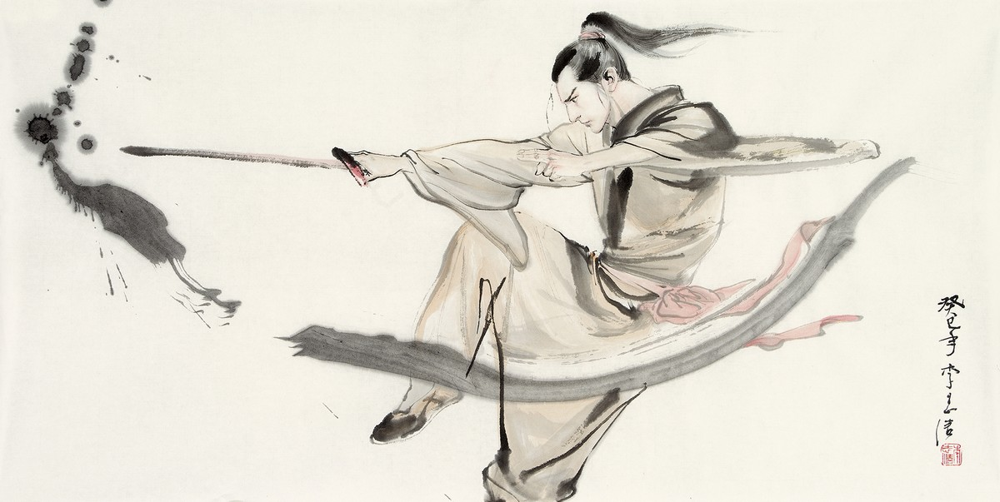

【第06话】试炼 《烂俗前端》

> 《烂俗前端》是一部以前端为题材的长篇小说，涉及讨论职业、社会、技术、情感等话题，正在更新中。全集链接：[烂俗前端](https://juejin.cn/column/7017997240325111845)，所有markdown和涉及的源码存放在：[github](https://github.com/doterlin/vulgar_fe)

------

“嘟~嘟~”赵铁柱拨通了之前那人给的电话，响了许久没人接，

“喂，哪位？”等了大约一分钟，接电话的是个女人的声音，声音里还带着些谨慎和不耐烦。

“额”铁柱楞了一下，怀疑是打错了。“请问吴明在吗？”

“哦，他到楼下拿快递，你有什么事吗？”那女人刚说完，铁柱就听到有关门的声音。听到电话那头的旁边有男人说，“给我吧，不是工作的事，也不是女生打过来的吧？”

“喂？铁柱是吗？”男人接了电话。

“是的，明哥是吧。”赵铁柱说，听到电话旁边那女人还嘟嘟囔囔：“周末老是有电话，不是这就是那的，咱俩都没啥时间出去逛逛。”

“一会，一会哈。”男人拿近了电话继续说，“是的，我是吴明。刚才那是我妻子，见笑了。”

“哦，大嫂呀，幸会幸会。”

“我们开始吧。我让你看的那些基础资料看了吗？嗯，听你阳刚中带着些疲惫，熬夜看的吧？”吴明说。

“明哥英明。”

短暂寒暄过后，吴明开始问问题：“第一个问题，你喜欢这个职业吗？你说真心话无妨，这个不是面试，我只是要多了解你，你好好想想。”

这类问题，大部分应届生大学生都没少思考，从懵懂的少年开始，大家就被送进幼儿园、小学、中学，当被问到“你喜欢学习吗？你喜欢某某学科吗？”这类话时，心里满是不喜欢，自己都有自己的兴趣爱好，有的喜欢打游戏，有的喜欢运动，有的喜欢唱歌跳舞，有的喜欢画画，还有少部分人喜欢计算机学科等等，那些最多只是你的课余爱好，你会迫不得已的去学一些不喜欢的东西，一天大部分醒着的时间都在学校上。

但，除了去学校他们又能做什么呢？你的家长绝对不会想过，拿你的未来赌在你的“兴趣爱好”上。

九年后熬到了以为是自由国度的大学时，想想差不多能学到自己想学的专业，老师和家长一套组合拳，帮他们选择尽量好的学校，“好”的专业，服从调剂，舍弃特定专业取高分学校，种种原因，没几个人的专业能是自己喜欢的。就算有幸选上了，你还是得消化一些诸如“高数”“历史”“物理”之类的学科。

大学的他们已经是成年人，独立思考的能力渐渐成熟，三观初成，即将面对社会，很多人大势之下直接放弃了自己曾经“喜欢”的梦想，受环境所驱使，更多的是思考生存的问题。

“说不上喜欢，迫于生计，但也不反感。”赵铁柱思考了一会毅然说到。

“那就够了，就怕是你逼迫自己，工作学习会有所障碍。”吴明貌似舒了一口气。“第二个问题，你对未来有什么规划？这个问题俗套了，面试中也经常问，但我还是希望你说心里话。我知道你缺面试经验，说不出太高大上的就简单说说。”

“这个我还真就想过。”赵铁柱说，吴明“嗯”了一下示意铁柱继续说，铁柱昨晚在舍友李学习那讨教了一番也在脑里也有个大概的轮廓，“以我的理解，程序员就是入行难，先是根据自身情况努力找个突破口进到对自己来说是好的企业，比如前端，入门了前端后面就升级加薪，做一名技术专家甚至架构师，更广泛的学习技术，成为公司大佬，或者找机会‘出圈’，创个业或转个行拼一拼。”

“没了吗。呵呵。还不错，但有一点建议，你如果坚持走技术路线，重在精，次在广。现在的社会越来越细分化职业和工作，在某一领域某一方向有所深究，才是别人认为的高价值人才，技术各个点有所涉猎，反倒无一擅长精通点。很多公司不太需要这样的人，他们希望高薪招来的人能做一些很少人能做的东西，工作内容也很清楚，不需要你去用你‘广’的知识去做其他工作。”吴明慢慢地说，旁边化好妆打了扮的妻子在镜子前摆着不同姿态。

赵铁柱认真听着：“领教了。”

“拿前端工程师来说，你在某一技术方向，诸如性能优化、代码重构、算法、框架设计等有深入研究，或者在业务领域如低代码零代码、数据可视化、VR有过深度实践和研究，那就是所谓的精。”吴明继续说。

“哎呀，晚上再聊不行吗？我鞋子都穿好了。一个小朋友而已。”铁柱隐约听到电话不远处的女人在说话，吴明马上不太高兴，“什么小朋友，尊重一下别人。马上就好了哈。”

吴明由拿起了手机对铁柱说，“别放心上铁柱，这两个问题你好好想想。真是不好意思，晚上咱们再通一次电话，到时候到具体的技术问题考考。”

“没事，明哥。好好陪一下嫂子，我的准师娘。”铁柱回答，心里也并无责怪，他觉得看似简单的两个问题，吴明已经用心地在引导他。

“呵呵，那先这样，晚上见。”吴明说完，妻子又在催促，“哎哟你快点的，不准穿拖鞋啊。”

“诶，好咧。”铁柱挂断了电话，一边感慨婚姻的生活，一边在满脑子想着“精”这个字，武林中的高手，想要立足江湖，哪个没有自己的炉火纯青的独门绝技？

-----

 > 未完待续，转载请注明出处

连载中，全集目录：[《烂俗前端》](https://juejin.cn/column/7017997240325111845)
